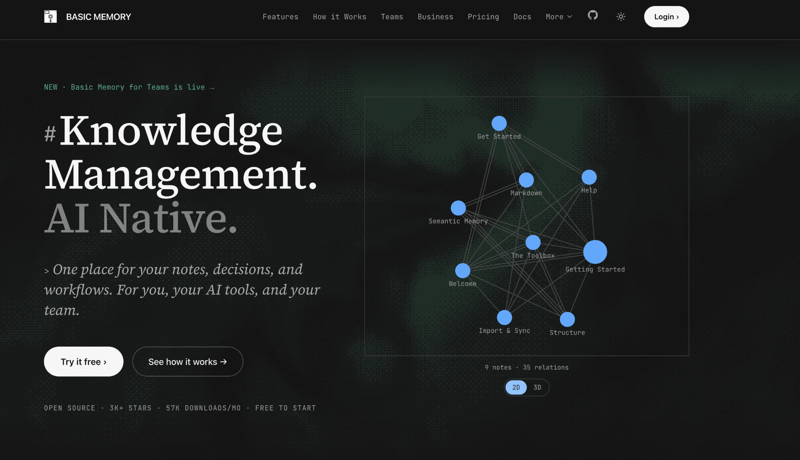
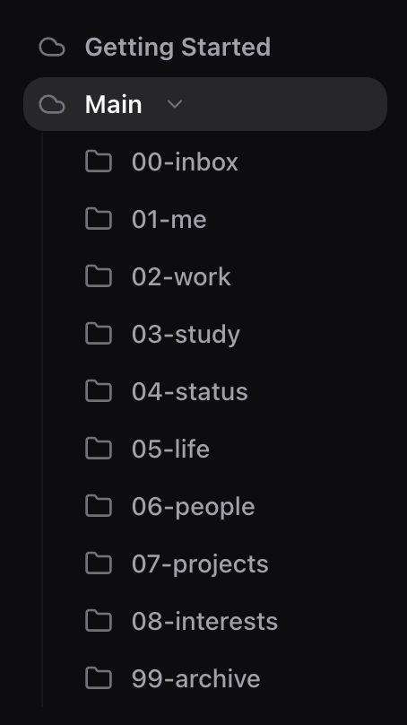

# Tool Reflection — Basic Memory

I kept re-explaining myself. Every new session with an AI started the same way — who I am, what I'm building, what I decided last week. I found Basic Memory while complaining about exactly that to an AI, which is a funny way to find a tool. Before it I kept the same notes in CLAUDE.md and HANDOFF.md files. Those worked until they didn't. They lived in one folder on one machine, so moving the folder lost them, and my phone and my desktop at home couldn't reach them at all. Basic Memory sits in the cloud and every device reads the same notes. What changed is that I don't brief the AI anymore. I open a session and it already knows my projects, my deadlines, and the things I already decided against. If it disappeared tomorrow I'd go back to markdown files pushed to GitHub, or move into Obsidian. Both would work. I'd just have to remember to update them myself, and I know myself well enough to know I wouldn't.

